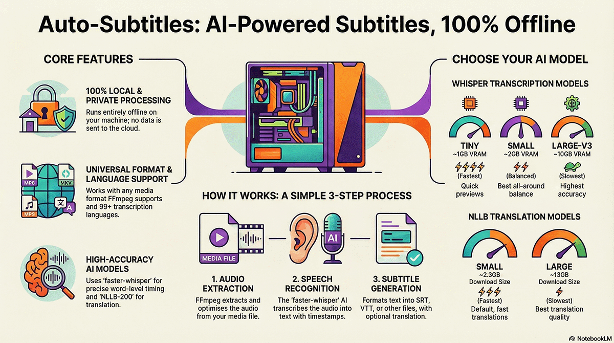

# Auto-Subtitles

Generate subtitle/transcript files from video or audio files using local AI speech recognition with [faster-whisper](#dependencies) and local AI translation with [NLLB-200](#dependencies). This script is just a wrapper/interfacing layer around ffmpeg (for audio extraction) and the models to make it easier to use. The heavy lifting is done by [ffmpeg](#dependencies), [faster-whisper](#dependencies) and [NLLB-200](#dependencies).

## Features

- 🎬 **Wide format support** - MP4, MKV, AVI, MOV, WebM, FLV, WMV, M4V, and more (any format FFmpeg supports)
- 🤖 **100% Local processing** - Uses [faster-whisper](#dependencies) + [NLLB-200](#dependencies) (runs entirely offline, complete privacy)
- 🎯 **Accurate timestamps** - Word-level timing for precise subtitles
- 🌍 **Multi-language support** - Auto-detection, translate to 68+ languages via [NLLB-200](#dependencies)
- 🔄 **Translation options** - Direct translation or via English (using Whisper's translation) for better accuracy
- 🎵 **Handles background music** - Trained to work with video soundtracks
- 📊 **Benchmark mode** - Compare all model sizes to find the best for your needs
- 💻 **Cross-platform** - Auto-detects optimal settings for:
  - NVIDIA GPU (CUDA with float16)
  - Apple Silicon (CPU with int8)
  - Intel/AMD CPU (CPU with int8)
- 💾 **Smart extraction** - Detects if file already has subtitles and offers to extract them instead of generating new ones

## Infographic

_Generated with NotebookLM based on the project code._



## Supported Formats

**Input** - Any format that FFmpeg can decode:

| Type | Extensions |
|------|------------|
| **Video** | `.mp4`, `.mkv`, `.avi`, `.mov`, `.webm`, `.flv`, `.wmv`, `.m4v`, `.mpg`, `.mpeg`, `.3gp`, `.ts`, `.mts`, `.m2ts` |
| **Audio** | `.mp3`, `.wav`, `.flac`, `.aac`, `.ogg`, `.m4a`, `.wma`, `.opus` |

**Output** - Subtitle and transcript formats:

| Format | Extension | Description |
|--------|-----------|-------------|
| **SRT** | `.srt` | SubRip - most universal, works everywhere (default) |
| **VTT** | `.vtt` | WebVTT - for web browsers and HTML5 video |
| **ASS** | `.ass` | Advanced SubStation Alpha - supports styling |
| **SUB** | `.sub` | MicroDVD - frame-based (use `--fps` to set rate) |
| **TXT** | `.txt` | Plain text transcript, no timestamps |
| **JSON** | `.json` | Structured data for programmatic use |

## Supported Languages

### Transcription (Whisper)

[Whisper](#dependencies) supports **99+ languages** with automatic detection. Specify with `-l, --language`:

```bash
python auto_subtitles.py sample-video.mp4                    # Auto-detect language
python auto_subtitles.py sample-video.mp4 --language ja      # Force Japanese (faster)
```

### Translation (NLLB-200)

Translate to **68 languages** using Meta's [NLLB-200](#dependencies) model. Use `--translate-to` or `--translate-via-english-to`:

```bash
python auto_subtitles.py sample-video.mp4 --translate-to fr           # Direct translation
python auto_subtitles.py sample-video.mp4 --translate-to en,fr,ja     # Multiple languages
python auto_subtitles.py sample-video.mp4 --translate-via-english-to fr  # Via English (uses Whisper to translate to English first)
```

Run `--list-all-supported-languages` to see all 68+ supported language codes.

### Supported Language Codes

| Language | Code | Whisper | NLLB | Language | Code | Whisper | NLLB |
|----------|------|:-------:|:----:|----------|------|:-------:|:----:|
| Afrikaans | `af` | ✅ | ✅ | Macedonian | `mk` | ✅ | ✅ |
| Albanian | `sq` | ✅ | ✅ | Malay | `ms` | ✅ | ✅ |
| Amharic | `am` | ✅ | ❌ | Malayalam | `ml` | ✅ | ✅ |
| Arabic | `ar` | ✅ | ✅ | Maltese | `mt` | ✅ | ✅ |
| Armenian | `hy` | ✅ | ✅ | Marathi | `mr` | ✅ | ✅ |
| Azerbaijani | `az` | ✅ | ✅ | Mongolian | `mn` | ✅ | ✅ |
| Basque | `eu` | ✅ | ❌ | Myanmar | `my` | ✅ | ✅ |
| Belarusian | `be` | ✅ | ❌ | Nepali | `ne` | ✅ | ✅ |
| Bengali | `bn` | ✅ | ✅ | Norwegian | `no` | ✅ | ✅ |
| Bosnian | `bs` | ✅ | ✅ | Pashto | `ps` | ✅ | ❌ |
| Bulgarian | `bg` | ✅ | ✅ | Persian | `fa` | ✅ | ✅ |
| Catalan | `ca` | ✅ | ❌ | Polish | `pl` | ✅ | ✅ |
| Chinese | `zh` | ✅ | ✅ | Portuguese | `pt` | ✅ | ✅ |
| Croatian | `hr` | ✅ | ✅ | Punjabi | `pa` | ✅ | ✅ |
| Czech | `cs` | ✅ | ✅ | Romanian | `ro` | ✅ | ✅ |
| Danish | `da` | ✅ | ✅ | Russian | `ru` | ✅ | ✅ |
| Dutch | `nl` | ✅ | ✅ | Serbian | `sr` | ✅ | ✅ |
| English | `en` | ✅ | ✅ | Sinhala | `si` | ✅ | ✅ |
| Estonian | `et` | ✅ | ✅ | Slovak | `sk` | ✅ | ✅ |
| Filipino | `tl` | ✅ | ✅ | Slovenian | `sl` | ✅ | ✅ |
| Finnish | `fi` | ✅ | ✅ | Somali | `so` | ✅ | ❌ |
| French | `fr` | ✅ | ✅ | Spanish | `es` | ✅ | ✅ |
| Galician | `gl` | ✅ | ❌ | Swahili | `sw` | ✅ | ✅ |
| Georgian | `ka` | ✅ | ✅ | Swedish | `sv` | ✅ | ✅ |
| German | `de` | ✅ | ✅ | Tamil | `ta` | ✅ | ✅ |
| Greek | `el` | ✅ | ✅ | Telugu | `te` | ✅ | ✅ |
| Gujarati | `gu` | ✅ | ✅ | Thai | `th` | ✅ | ✅ |
| Hausa | `ha` | ✅ | ❌ | Turkish | `tr` | ✅ | ✅ |
| Hebrew | `he` | ✅ | ✅ | Ukrainian | `uk` | ✅ | ✅ |
| Hindi | `hi` | ✅ | ✅ | Urdu | `ur` | ✅ | ✅ |
| Hungarian | `hu` | ✅ | ✅ | Uzbek | `uz` | ✅ | ✅ |
| Icelandic | `is` | ✅ | ✅ | Vietnamese | `vi` | ✅ | ✅ |
| Indonesian | `id` | ✅ | ✅ | Welsh | `cy` | ✅ | ✅ |
| Italian | `it` | ✅ | ✅ | Yiddish | `yi` | ✅ | ❌ |
| Japanese | `ja` | ✅ | ✅ | Yoruba | `yo` | ✅ | ❌ |
| Kannada | `kn` | ✅ | ✅ | Zulu | `zu` | ❌ | ✅ |
| Kazakh | `kk` | ✅ | ✅ | | | | |
| Khmer | `km` | ✅ | ✅ | | | | |
| Korean | `ko` | ✅ | ✅ | | | | |
| Lao | `lo` | ✅ | ✅ | | | | |
| Latvian | `lv` | ✅ | ✅ | | | | |
| Lithuanian | `lt` | ✅ | ✅ | | | | |

> **Note:** [Whisper](#dependencies) supports 99 languages (✅ = supported). [NLLB-200](#dependencies) supports 200+ languages, but we've enabled the most common 68 overlapping ones here (✅ = supported). Run `python auto_subtitles.py --list-all-supported-languages` for the full list available in this tool.

> **Tip:** [Whisper](#dependencies) supports additional languages for transcription beyond what [NLLB-200](#dependencies) supports for translation.

## Prerequisites

1. **Python 3.12** (recommended) or **Python 3.10+** (tested on 3.10 and 3.11)
2.  **FFmpeg** must be installed and in your system PATH.
    -   **macOS**: `brew install ffmpeg`
    -   **Ubuntu/Debian**: `sudo apt install ffmpeg`
    -   **Windows**: Download from [ffmpeg.org](https://ffmpeg.org/download.html) and add `bin` folder to Path.

### Python Dependencies (installed via requirements.txt)

-   **faster-whisper**: Optimized implementation of Whisper for fast inference
-   **torch**: PyTorch for tensor computations and hardware acceleration
-   **transformers**: Hugging Face library for NLLB translation models
-   **sentencepiece**: Tokenizer required for NLLB translation models

## Installation

```bash
# 1. Clone or navigate to the project
cd auto-subtitles

# 2. Create virtual environment with Python 3.12
   # macOS (Homebrew):
   /opt/homebrew/bin/python3.12 -m venv venv

   # Linux:
   python3.12 -m venv venv

   # Windows:
   py -3.12 -m venv venv

# 3. Activate the virtual environment
   # macOS/Linux:
   source venv/bin/activate  

   # Windows:
   venv\Scripts\activate

# 4. Install dependencies
pip install -r requirements.txt
```

## Usage

### Basic Usage

```bash
# Generate subtitles from video (output: sample-video.srt)
python auto_subtitles.py sample-video.mp4

# Generate transcript from audio (output: sample-audio.srt)
python auto_subtitles.py sample-audio.mp3

# Specify output file
python auto_subtitles.py sample-video.mkv -o my_subtitles.srt
```

### Benchmark Mode
 
 Compare all model sizes to find the best one for your system:
 
 ```bash
 # Run FULL benchmark (Whisper Transcription + NLLB Translation)
 python auto_subtitles.py sample.mp4 --benchmark
 
 # Run Transcription-only benchmark (Whisper only)
 python auto_subtitles.py sample.mp4 --benchmark-transcribe-only
 ```
 
 The **Full Benchmark** will:
 1. **Test all Whisper models** (tiny, base, small, medium, large-v3) -> Show Transcription Results Table at the end of the benchmark process
 2. **Test all NLLB models** (small, medium, large) -> Show Translation Results Table at the end of the benchmark process
 3. Recommend the best models for your needs
 
 The **Transcribe-only Benchmark** only performs step 1.

### Advanced Options

```bash
# Use larger model for better accuracy (recommended for videos with music)
python auto_subtitles.py sample-video.mp4 --model large-v3

# Specify language (faster, recommended if you know the language)
python auto_subtitles.py sample-video.mp4 --language en

# Force CPU processing
python auto_subtitles.py sample-video.mp4 --device cpu

# Translate any language to English subtitles
python auto_subtitles.py foreign-video.mkv --translate
python auto_subtitles.py japanese-anime.mkv --translate --model large-v3

# Anti-Hallucination Tuning (Critical for noisy audio recordings)
# Use these flags to stop the model from transcribing noise or getting stuck in loops.
# VAD: Voice Activity Detection
# - vad-min-silence: 500ms (0.5s) to ignore short noises
# - vad-threshold: 0.7 to strictly require speech
# - no-condition-on-previous-text: PREVENTS hallucination loops (crucial)
# - no-speech-threshold: 0.4 to drop more "noise" segments
# - logprob-threshold: -0.8 to drop unsure guesses
# - vad-min-speech-duration: 500ms to ignore short coughs/scratches
# - vad-speech-pad: 100ms to stop grabbing nearby noise
python auto_subtitles.py video.mkv \
  --vad-min-silence 500 \
  --vad-threshold 0.7 \
  --no-condition-on-previous-text \
  --no-speech-threshold 0.4 \
  --logprob-threshold -0.8 \
  --vad-min-speech-duration 500 \
  --logprob-threshold -0.8 \
  --vad-min-speech-duration 500 \
  --vad-speech-pad 100
```
### Easy VAD Presets
Instead of typing all the VAD flags manually, you can use the built-in presets:

```bash
# Preset 1: Noisy (Strict)
# Equivalent to the command above
python auto_subtitles.py video.mkv --vad-set-1

# Preset 2: Sensitive (Quiet/Faint Speech)
python auto_subtitles.py video.mkv --vad-set-2
```


### Translation Mode

Use `--translate` to produce **English subtitles from any language**:

```bash
# French audio → English subtitles (output: french-video.en.srt)
python auto_subtitles.py french-video.mkv --translate

# Japanese anime → English subtitles with best accuracy
python auto_subtitles.py anime.mkv --translate --model large-v3

# French podcast → English transcript
python auto_subtitles.py french-podcast.mp3 --translate
```

### Subtitle Extraction

If the input video **already contains a subtitle track**, the script will detect it and ask you:

```
⚠️  Subtitle stream detected in the input file!
   Do you want to extract existing subtitles instead of generating new ones? (y/n):
```

- Type **`y`** to extract the existing subtitle to a file (converting format if needed).
- Type **`n`** (or just Enter) to ignore it and generate new AI subtitles.


> **Note:** Translation works from any of the 99+ supported languages TO English. This is a one-way translation feature built into [Whisper](#dependencies).

### Output Formats

Multiple output formats are supported:

```bash
# Default SRT format
python auto_subtitles.py sample-video.mp4

# WebVTT for web/HTML5 video
python auto_subtitles.py sample-video.mp4 --format vtt

# ASS for styled subtitles (anime, karaoke)
python auto_subtitles.py sample-video.mp4 --format ass

# SUB (MicroDVD) with custom frame rate
python auto_subtitles.py sample-video.mp4 --format sub --fps 23.976

# SUB (MicroDVD) with auto-detected frame rate
# (Requires FFmpeg/ffprobe installed to detect FPS from video content)
python auto_subtitles.py sample-video.mp4 --format sub

# Plain text transcript (no timestamps)
python auto_subtitles.py sample-audio.mp3 --format txt

# JSON for programmatic use
python auto_subtitles.py sample-video.mp4 --format json
```

| Format | Extension | Description |
|--------|-----------|-------------|
| `srt` | `.srt` | SubRip - most universal, works everywhere |
| `vtt` | `.vtt` | WebVTT - for web browsers and HTML5 video |
| `ass` | `.ass` | Advanced SubStation Alpha - supports styling |
| `sub` | `.sub` | MicroDVD - frame-based (use `--fps` to set frame rate) |
| `txt` | `.txt` | Plain text transcript, no timestamps |
| `json` | `.json` | Structured data for programmatic use |

### Available Options

| Option | Description |
|--------|-------------|
| `-o, --output` | Output file path (default: same filename as input with output extension) |
| `-m, --model` | [Whisper](#dependencies) model size: `tiny`, `base`, `small`, `medium`, `large-v3` (default: `medium`) |
| `-l, --language` | Language code (e.g., `en`, `es`, `fr`) (default: auto-detected) |
| `-d, --device` | Processing device: `auto`, `cpu`, `cuda` (default: `auto`) |
| `-b, --benchmark` | Run full benchmark: test all Whisper (transcription) and NLLB (translation) models |
| `--benchmark-transcribe-only` | Run benchmark: test all Whisper (transcription) models only |
| `-t, --translate` | Translate to English using [Whisper](#dependencies) |
| `--translate-to` | Translate to target language(s) using [NLLB-200](#dependencies) (e.g., `fr`, `en,fr,ja`) |
| `--translate-via-english-to` | Translate via English using [Whisper's](#dependencies) internal translation, then [NLLB-200](#dependencies) for target (e.g., `fr`) |
| `--translation-model` | [NLLB-200](#dependencies) model size: `small`, `medium`, `large` (default: `small`) |
| `-f, --format` | Output format: `srt`, `vtt`, `ass`, `sub`, `txt`, `json` (default: `srt`) |
| `--fps` | Frames per second for SUB format. (default: auto-detected, or 25.0) |
| `-q, --quiet` | Suppress console output of generated subtitles (default: `False`) |
| `--list-all-supported-languages` | List all 68 supported language codes |
| `--vad-min-silence` | VAD (Voice Activity Detection):  Minimum silence duration (ms) to split segments (default: `2000`). Increase to ignore short noises. |
| `--vad-threshold` | VAD (Voice Activity Detection): Speech probability threshold (0.0-1.0) (default: `0.5`). Increase to require clearer speech. |
| `--no-condition-on-previous-text` | Disable using previous segment as context. Prevents hallucination loops, makes segments independent. |
| `--no-speech-threshold` | Threshold to skip silent segments (default: `0.6`). Increase to be stricter about what counts as speech. |
| `--logprob-threshold` | Threshold to skip low-confidence segments (default: `-1.0`). Increase (e.g. `-0.5`) to strictly filter "guesses". |
| `--temperature` | Sampling temperature (default: `0.0`). `0.0` = deterministic (best). Higher values (`0.2`-`1.0`) = more creative/random (riskier). |
| `--vad-min-speech-duration` | VAD (Voice Activity Detection): Minimum duration of speech (ms) to keep (default: `250`). Increase (e.g. `500`) to ignore short noise bursts. |
| `--vad-speech-pad` | VAD (Voice Activity Detection): Padding (ms) to add to each side of speech (default: `400`). Reduce (e.g. `50`) to stop merging noise with speech. |
| `--vad-set-1` | **Noisy Audio Preset**. Strict values to filter background noise: `vad_threshold=0.7` (Ignore ambiguous noise), `vad_min_silence=500` (Split frequently), `vad_min_speech_duration=500` (Ignore short bursts), `vad_speech_pad=100` (Reduce noise overlap), `no_condition_on_previous_text` (Prevent loops), `no_speech_threshold=0.4` (Drop silence), `logprob_threshold=-0.8` (Drop guesses). |
| `--vad-set-2` | **Sensitive / Quiet Audio Preset**. Gentle values to catch faint speech: `vad_threshold=0.35` (Catch whispers), `vad_min_speech_duration=200` (Keep short words), `vad_speech_pad=500` (Add context), `vad_min_silence=1000` (Standard splits). |

### Multi-Language Translation

Translate to any language supported by [NLLB-200](#dependencies) (60+ languages):

```bash
# Translate directly to French
python auto_subtitles.py japanese-video.mp4 --translate-to fr

# Generate multiple languages at once
python auto_subtitles.py sample-video.mp4 --translate-to en,fr,de

# For difficult languages, translate via English (uses Whisper to translate to English first)
python auto_subtitles.py chinese-video.mp4 --translate-via-english-to fr
```

**Supported language codes for `--translate-to` and `--translate-via-english-to`:**

| Code | Language | Code | Language | Code | Language |
|------|----------|------|----------|------|----------|
| `en` | English | `es` | Spanish | `fr` | French |
| `de` | German | `it` | Italian | `pt` | Portuguese |
| `ru` | Russian | `zh` | Chinese | `ja` | Japanese |
| `ko` | Korean | `ar` | Arabic | `hi` | Hindi |
| `nl` | Dutch | `pl` | Polish | `tr` | Turkish |
| `sv` | Swedish | `no` | Norwegian | `da` | Danish |
| `fi` | Finnish | `el` | Greek | `he` | Hebrew |
| `th` | Thai | `vi` | Vietnamese | `id` | Indonesian |
| `bg` | Bulgarian | `uk` | Ukrainian | `cs` | Czech |
| `ro` | Romanian | `hu` | Hungarian | `sk` | Slovak |
| `hr` | Croatian | `sr` | Serbian | `sl` | Slovenian |
| `et` | Estonian | `lv` | Latvian | `lt` | Lithuanian |
| `mk` | Macedonian | `sq` | Albanian | `bs` | Bosnian |
| `mt` | Maltese | `is` | Icelandic | `ga` | Irish |
| `cy` | Welsh | `af` | Afrikaans | `sw` | Swahili |
| `bn` | Bengali | `ta` | Tamil | `te` | Telugu |
| `ml` | Malayalam | `kn` | Kannada | `mr` | Marathi |
| `gu` | Gujarati | `pa` | Punjabi | `ur` | Urdu |
| `fa` | Persian | `ms` | Malay | `tl` | Filipino |
| `my` | Myanmar | `km` | Khmer | `lo` | Lao |
| `ne` | Nepali | `si` | Sinhala | `ka` | Georgian |
| `hy` | Armenian | `az` | Azerbaijani | `kk` | Kazakh |
| `uz` | Uzbek | `mn` | Mongolian | | |

## Model Sizes

### Whisper Models (Transcription)

Choose the right transcription model for your needs, for `--model` or `-m` option use one of those:

| Model | Download | VRAM | Speed | Best For |
|-------|----------|------|-------|----------|
| `tiny` | ~75MB | ~1GB | ⚡⚡⚡⚡ | Quick previews, ~30x realtime |
| `base` | ~145MB | ~1GB | ⚡⚡⚡ | Simple content, ~17x realtime |
| `small` | ~480MB | ~2GB | ⚡⚡ | **Best balance**, ~6x realtime |
| `medium` | ~1.5GB | ~5GB | ⚡ | High accuracy, ~2.5x realtime |
| `large-v3` | ~3GB | ~10GB | 🐢 | Best accuracy, ~0.8x realtime |

> **Tip:** Run `--benchmark` (includes transcription and translation benchmarks) or `--benchmark-transcribe-only` (includes transcription benchmarks only) on a short sample to find the best model for your hardware.

### NLLB Models (Translation)

For `--translate-to` and `--translate-via-english-to` options use one of those:

| Model | Option | Download | Speed | Best For |
|-------|--------|----------|-------|----------|
| `nllb-200-distilled-600M` | `--translation-model small` | ~2.3GB | ⚡⚡⚡ | **Default**, fast translations |
| `nllb-200-distilled-1.3B` | `--translation-model medium` | ~5GB | ⚡⚡ | Better quality |
| `nllb-200-3.3B` | `--translation-model large` | ~13GB | ⚡ | Best quality |

> **Tip:** Run `--benchmark` (includes transcription and translation benchmarks) on a short sample to find the best model for your hardware.

```bash
# Fast translation (default)
python auto_subtitles.py video.mp4 --translate-to fr

# Higher quality translation
python auto_subtitles.py video.mp4 --translate-to fr --translation-model large
```

### Understanding Segments

A **segment** is one subtitle block - a piece of text with start and end timestamps. Each numbered entry in an SRT file is one segment.

**Larger models produce fewer segments** because they're smarter at grouping speech naturally:

| Model | Example Output |
|-------|----------------|
| tiny | `"Hello"` → `"how are"` → `"you today?"` (3 fragmented segments) |
| large-v3 | `"Hello, how are you today?"` (1 complete sentence) |

**Fewer segments is often better** for videos and TV because:
- Subtitles stay on screen longer (easier to read)
- More natural sentence grouping with proper punctuation
- Less visual "jumping" between subtitles

**More segments can be useful** for:
- Lectures/tutorials where precise timestamps matter
- Fast-paced dialogue with quick speaker changes

## Examples

```bash
# Video with lots of background music - use large model
python auto_subtitles.py sample-video.mkv --model large-v3
python auto_subtitles.py sample-audio.mp3 --model large-v3

# Quick transcription for a lecture
python auto_subtitles.py lecture.mp4 --model small
python auto_subtitles.py podcast.mp3 --model small

# Spanish content
python auto_subtitles.py pelicula.mp4 --language es
python auto_subtitles.py audio-espanol.mp3 --language es

# Benchmark to find best model for your system
python auto_subtitles.py sample-video.mp4 --benchmark
python auto_subtitles.py sample-audio.mp3 --benchmark

# Process on CPU only (slower but works without GPU)
python auto_subtitles.py sample-video.mp4 --device cpu --model small
```

## Output

The tool generates a standard SRT file that works with any video player:

```srt
1
00:00:01,520 --> 00:00:04,180
Welcome to the presentation.

2
00:00:04,500 --> 00:00:07,890
Today we'll discuss the new features.
```

## How It Works

1. **System Detection** - [PyTorch](#dependencies) automatically detects your hardware (Apple Silicon, NVIDIA GPU, or CPU) to optimize performance.
2. **Audio Extraction** - [FFmpeg](#dependencies) extracts the audio track from the video file and converts it to the optimized format (16kHz mono WAV) required by AI models.
3. **Speech Recognition** - [faster-whisper](#dependencies) transcribes the audio into text, generating precise word-level timestamps.
4. **Translation (Optional)** - If translation is requested:
   - **Direct:** Text is passed to [NLLB-200](#dependencies) for translation.
   - **Via English:** Whisper first transcribes to English, then [NLLB-200](#dependencies) translates.
   - **Tokenization:** [sentencepiece](#dependencies) processes text into tokens that the NLLB model can understand.
5. **Subtitle Generation** - The final text is formatted into properly timed subtitles (SRT, VTT, etc.).

All processing happens **100% locally** on your machine. No data is sent to any cloud service.

### First Run - Model Download

On first use of each model size, the AI model weights are downloaded from Hugging Face Hub and cached locally (~/.cache/huggingface/). You may see this warning:

```
Warning: You are sending unauthenticated requests to the HF Hub.
```

**This is normal** - it just means the download has rate limits. The models are only downloaded once and then cached for future use. All actual transcription processing happens entirely offline.

## Troubleshooting

### "FFmpeg not found"
Make sure FFmpeg is installed and in your PATH:
```bash
ffmpeg -version
```

### Out of memory
Use a smaller model:
```bash
python auto_subtitles.py video.mp4 --model small --device cpu
```

### Poor accuracy
- Use a larger model (`large-v3`)
- Specify the language explicitly with `--language`
- Check if audio quality in the source video is good

### Hallucinations / Noise / Timestamps drift
If the model hallucinates or includes noise:
*   Use **VAD Presets**: `--vad-set-1` (Noisy) or `--vad-set-2` (Quiet).
*   Tune manually: `--vad-min-speech-duration`, `--vad-threshold`, `--no-condition-on-previous-text`.
*   See [Anti-Hallucination Tuning](#anti-hallucination-tuning-critical-for-noisy-audio-recordings) for details.

### Slow processing
- Use a smaller model (`tiny` or `base`)
- Run `--benchmark` to find the sweet spot for your hardware

## Dependencies

This project uses the following open-source libraries:

| Dependency | Purpose | GitHub |
|------------|---------|--------|
| [faster-whisper](https://github.com/SYSTRAN/faster-whisper) | Speech-to-text transcription | [SYSTRAN/faster-whisper](https://github.com/SYSTRAN/faster-whisper) |
| [transformers](https://github.com/huggingface/transformers) | NLLB translation models | [huggingface/transformers](https://github.com/huggingface/transformers) |
| [PyTorch](https://github.com/pytorch/pytorch) | GPU/CPU detection | [pytorch/pytorch](https://github.com/pytorch/pytorch) |
| [sentencepiece](https://github.com/google/sentencepiece) | NLLB tokenization | [google/sentencepiece](https://github.com/google/sentencepiece) |
| [FFmpeg](https://github.com/FFmpeg/FFmpeg) | Audio extraction & FPS detection | [FFmpeg/FFmpeg](https://github.com/FFmpeg/FFmpeg) |

**AI Models used:**
- **Whisper** by OpenAI - [openai/whisper](https://github.com/openai/whisper)
- **NLLB-200** by Meta AI - [facebookresearch/fairseq](https://github.com/facebookresearch/fairseq/tree/nllb)

## Disclaimer

This tool is provided for **personal use only**. The project owner and contributors assume no responsibility or liability for how users choose to use this script or for any content processed with it. Users are solely responsible for ensuring their use of this tool complies with all applicable laws and regulations in their jurisdiction. The best use case is to generate subtitles on personal video recordings or royalty free video content.

Additionally, please be aware that transcription and translation are performed by probabilistic AI models. While often highly accurate, the results are **not guaranteed to be perfect** and may contain inaccuracies, omissions, or hallucinations. Manual review and editing of the generated subtitles is recommended, especially for critical applications.

Project code was written with the help of [Antigravity](https://antigravity.google/) under human (developer) initiative, guidance, and improvements over many iterations (even before it was first published on GitHub).

## License

MIT License